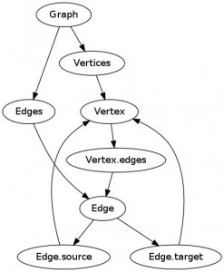

# Rgraphum

rgraphum is the open source for graph and complicated network analysis written by ruby.

## Installation

Add this line to your application's Gemfile:

    gem 'rgraphum'

And then execute:

    $ bundle

Or install it yourself as:

    $ gem install rgraphum

## Usage

rgraphum is framework and a console application for analysis of graph and complex network.
It is made of ruby, you can accept the code of ruby.
Now, let’s see while using the console application an overview.

start console application

    $ rgraphum_console

#### graph structure of rgraphum (new, added, traverse)

By creating an instance of the Graph class, rgraphum will have the entity graph.
graph = Graph.new
Instance of Graph will have an instance of Vertices and an instance of the Edges, such as Array.
graph.vertices
graph.edges
(An array of empty initial both)

When adding vertex or edge, it is operation on vertices, edges, and vertex.edges.
vertex or edge is specified in an instance such as the Hash.

    v_a = graph.vertices.build(label:"A")
    v_b = graph.vertices.build(label:"B")
    graph.edges.build(source:v_a,target:v_b)
    v_a.edges.build(source:v_b,target:v_a)

vertex will have edges being like a Array.
edge in the edges refers to the object.
This is the same as the one in the edges of the graph.

    v_a.edges
    e_a_b = v_a.edges[0]
    graph.edges
    graph.edges[0].object_id
    e_a_b.object_id

edge has a target and source, these are objects of vertex.
This is the same as the one in the graph.vertices.

    s_v= e_a_b.source
    t_v = e_a_b.target
    s_v.object_id
    t_v.object_id
    graph.vertices[0].object_id
    graph.vertices[1].object_id

#### search

search is done in graph.vertices, graph.edges, and vertex.edges.

    v_a = graph.vertices.where(label:"A").first
    v_a = graph.vertices.where(label:"A")[0]
    e_a_b = graph.edges.where(source:v_a).first
    e_a_b = v_a.edges.where(source:v_a).first

#### delete

Delete as well, do in graph.vertices, graph.edges, and vertex.edges.

    graph.edges
    v_a.edges
    e_b_a = v_a.edges[1]
    v_a.delete(e_b_a)
    v_a.edges

    graph.edges
    v_a.edges
    e_a_b = v_a.edges[0]
    graph.edges.delete(e_a_b)
    v_a.edges

    graph.vertices
    graph.vertices.delete(v_a)
    graph.vertices

#### sample

As a sample, The graph above, on the console, was made the following script.

    graph = Graph.new
    v_g = graph.vertices.build(label:"Graph")
    v_vs = graph.vertices.build(label:"Vertices")
    v_es = graph.vertices.build(label:"Edges")
    graph.edges.build(source:v_g,target:v_vs)
    graph.edges.build(source:v_g,target:v_es)

    v_v = graph.vertices.build(label:"Vertex")
    v_e = graph.vertices.build(label:"Edge")
    graph.edges.build(source:v_vs,target:v_v)
    graph.edges.build(source:v_es,target:v_e)

    v_v_es = graph.vertices.build(label:"Vertex.edges")
    graph.edges.build(source:v_v,target:v_v_es)
    graph.edges.build(source:v_v_es,target:v_e)

    v_e_s = graph.vertices.build(label:"Edge.source")
    v_e_t = graph.vertices.build(label:"Edge.target")
    graph.edges.build(source:v_e,target:v_e_s)
    graph.edges.build(source:v_e,target:v_e_t)
    graph.edges.build(source:v_e_s,target:v_v)
    graph.edges.build(source:v_e_t,target:v_v)

    Parsers::GraphvizParser.export(graph,"graph_struct","jpg")

## Contributing

1. Fork it
2. Create your feature branch (`git checkout -b my-new-feature`)
3. Commit your changes (`git commit -am 'Add some feature'`)
4. Push to the branch (`git push origin my-new-feature`)
5. Create new Pull Request

